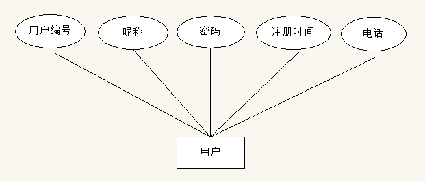
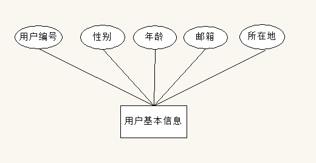
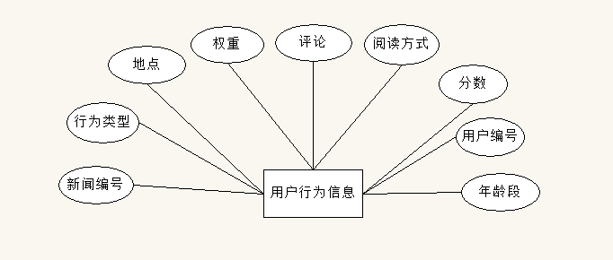
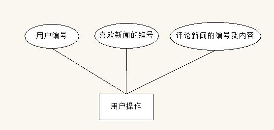
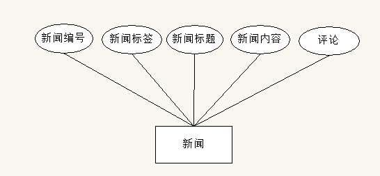
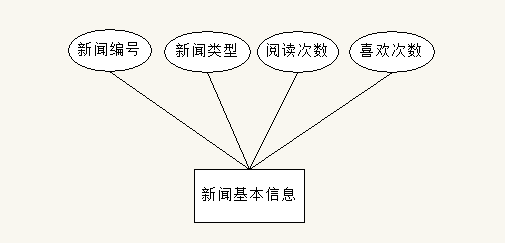
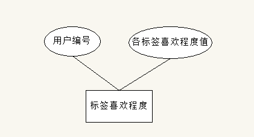
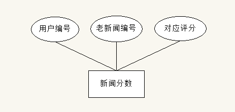
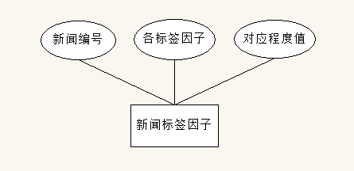
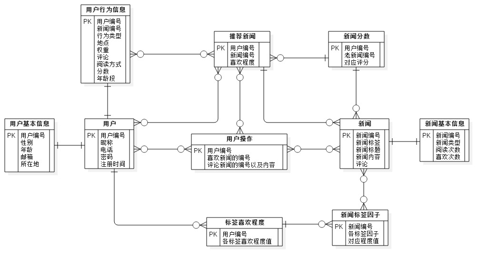

## 互联网内容推荐系统数据库设计

### 1.环境要求

​	语言：`python3.5`

​	数据库：`mysql5.0`以上

​	系统：`linux`系列皆可

### 2.数据库需求分析

​	对于互联网内容推荐系统，经过分析后，设计的数据项和数据结构如下：

| 名称     | 数据项                                 |
| :----- | :---------------------------------- |
| 用户     | 用户编号，昵称，电话，密码（token+MD5），注册时间       |
| 用户基本信息 | 用户编号，性别，年龄，邮箱，所在地                   |
| 用户行为信息 | 用户编号，新闻编号，行为类型，地点，权重，评论，阅读方式，分数，年龄段 |
| 用户操作   | 用户编号，喜欢新闻的编号，评论新闻的编号以及内容（用-隔开）      |
| 新闻     | 新闻编号，新闻标签，新闻标题，新闻内容，评论              |
| 新闻基本信息 | 新闻编号，新闻类型，阅读次数，喜欢次数                 |
| 标签喜欢程度 | 用户编号，各标签+喜欢程度值                      |
| 老新闻分数  | 用户编号，老新闻编号，对应评分                     |
| 新闻标签因子 | 新闻编号，各标签因子+对应程度值                    |
| 推荐新闻   | 用户编号，新新闻编号，喜欢程度                     |

### 3.数据库概念结构设计

​	根据上面的设计，可以得出有以下实体`E-R图`：用户实体，用户基本信息实体，用户行为信息实体，用户操作实体，新闻实体，新闻基本信息实体，标签喜欢程度实体，老新闻分数实体，新闻标签因子实体，推荐新闻实体。

##### 	3-1.用户实体：

​	 

##### 	3-2.用户基本信息实体：

​	 

##### 	3-3.用户行为信息实体：

##### 	

##### 	3-4.用户操作实体：

##### 	

##### 	3-5.新闻实体：

 	

##### 	3-6.新闻基本信息实体：

​	 

##### 	3-7.标签喜欢程度实体：

​	 

##### 	3-8.老新闻分数实体：

​	 

##### 	3-9.新闻标签因子实体：

​	 

##### 	3-10.推荐新闻实体：

​	 

##### 	3-11.实体联系图：		

### 4.数据库逻辑结构设计

##### 	1.用户表(news.user)

|   列名    |    数据类型     |     是否为空      |       说明       |
| :-----: | :---------: | :-----------: | :------------: |
| user_id | varcher(10) |   not null    |    (PK)用户编号    |
|  phone  | varcher(20) |   not null    |      用户电话      |
|  name   | varcher(20) |   not null    | 用户昵称(默认为phone) |
| passwd  | varcher(40) |   not null    |       密码       |
|  time   |  timestamp  | default now() |      注册时间      |

```mysql
-- Table: user
CREATE TABLE `user` (
  `user_id` varchar(10) NOT NULL,
  `phone` varchar(20) NOT NULL,
  `name` varchar(20) NOT NULL,
  `passwd` varchar(40) NOT NULL,
  `time` timestamp NOT NULL DEFAULT CURRENT_TIMESTAMP ON UPDATE CURRENT_TIMESTAMP,
  PRIMARY KEY (`user_id`),
  UNIQUE KEY `phone` (`phone`),
  UNIQUE KEY `name` (`name`)
) ENGINE=InnoDB DEFAULT CHARSET=utf8;
```

##### 	2.用户基本信息表(news.user_mess)

|   列名    |    数据类型     |    是否为空     |           说明            |
| :-----: | :---------: | :---------: | :---------------------: |
| user_id | varcher(10) |  not null   | 用户编号(FK)，指向user的user_id |
|   sex   |     int     |    null     |          用户性别           |
|   age   |     int     | not aeanull |          用户年纪           |
|  email  | varcher(20) |    null     |          用户邮箱           |
| address | varcher(40) |    null     |          用户地址           |

```mysql
-- Table: user_mess
CREATE TABLE `user_mess` (
  `user_id` varchar(10) NOT NULL,
  `sex` int(11) DEFAULT NULL,
  `age` int(11) DEFAULT NULL,
  `email` varchar(20) DEFAULT NULL,
  `address` varchar(40) DEFAULT NULL,
  UNIQUE KEY `email` (`email`),
  KEY `user_id` (`user_id`),
  CONSTRAINT `fk_user_mess` FOREIGN KEY (`user_id`) REFERENCES `user` (`user_id`)
) ENGINE=InnoDB DEFAULT CHARSET=utf8;
```

##### 	3.用户行为信息表(news.behavior)

|       列名        |    数据类型     |     是否为空      |             说明             |
| :-------------: | :---------: | :-----------: | :------------------------: |
|     user_id     | varcher(10) |   not null    |  用户编号(FK)，指向user的user_id   |
|     new_id      | varcher(20) |   not null    | 新闻编号(FK)，指向get_news的new_id |
|  behavior_type  |     int     |   not null    |     对该新闻的行为类型：浏览、喜欢、跳过     |
|  context_time   |  timestamp  | default now() |            浏览时间            |
| context_address | varcher(20) |   not null    |            浏览地点            |
|     weight      |  timestamp  | default now() |            浏览时长            |
|     content     | varchar(20) |     null      |             评论             |
|    news_way     |     int     |   default 0   |        搜索或者推荐方式阅读新闻        |
|     scores      |     int     |   not null    |        特定用户对特定新闻的分数        |
|       age       |     int     |   not null    |             年龄             |

##### 	4.用户操作表(news.user_operate)

|   列名    |     数据类型      |   是否为空   |             说明             |
| :-----: | :-----------: | :------: | :------------------------: |
| user_id |  varcher(10)  | not null |  用户编号(FK)，指向user的user_id   |
| new_id  |  varcher(20)  | not null | 新闻编号(FK)，指向get_news的new_id |
| comment | varchar(2000) |   null   |     评论新闻的编号以及内容（用-隔开）      |

##### 	5.新闻表(news.get_news)

|   列名    |      数据类型      |   是否为空   |    说明    |
| :-----: | :------------: | :------: | :------: |
| new_id  |  varcher(20)   | not null | 新闻编号(PK) |
|   tag   |  varcher(20)   | not null |   新闻标签   |
|  title  |  varcher(10)   | not null |   新闻标题   |
| content | varcher(50000) | not null |   新闻内容   |
| comment | varchar(5000)  |   null   |   新闻评论   |

##### 	6.新闻基本信息表(news.new_mess)

|     列名     |    数据类型     |        是否为空        |             说明             |
| :--------: | :---------: | :----------------: | :------------------------: |
|   new_id   | varcher(20) |      not null      | 新闻编号(FK)，指向get_news的new_id |
|    type    | varcher(20) |      not null      |            新闻类型            |
| read_times |     int     |      not null      |            阅读次数            |
| love_times |     int     | not null default 0 |            喜欢次数            |

##### 	7.标签喜欢程度表(news.tag)

|    列名    |    数据类型     |   是否为空   |           说明            |
| :------: | :---------: | :------: | :---------------------: |
| user_id  | varcher(10) | not null | 用户编号(FK)，指向user的user_id |
| tag_deep |    float    | not null |         标签+程度值          |
|   ...    |    float    | not null |         标签+程度值          |

##### 	8.老新闻分数表(news.score)

|   列名    |    数据类型     |   是否为空   |             说明             |
| :-----: | :---------: | :------: | :------------------------: |
| user_id | varcher(10) | not null |  用户编号(FK)，指向user的user_id   |
| new_id  | varcher(20) | not null | 新闻编号(FK)，指向get_news的new_id |
|  score  |     int     | not null |          用户给与的评分           |

##### 	9.新闻标签因子表(news.tag_div)

|    列名    |    数据类型     |   是否为空   |             说明             |
| :------: | :---------: | :------: | :------------------------: |
|  new_id  | varcher(20) | not null | 新闻编号(FK)，指向get_news的new_id |
| tag_deep |    float    | not null |           标签+程度值           |
|   ...    |    float    | not null |           标签+程度值           |

##### ​	10.推荐新闻表(news.recommend)

|    列名    |    数据类型     |   是否为空   |             说明             |
| :------: | :---------: | :------: | :------------------------: |
| user_id  | varcher(10) | not null |  用户编号(FK)，指向user的user_id   |
|  new_id  | varcher(20) | not null | 新闻编号(FK)，指向get_news的new_id |
| new_deep |     int     | not null |          对该新闻喜欢程度          |


